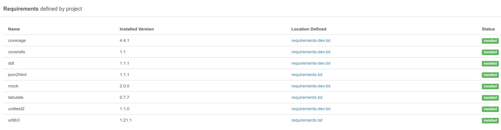

Installation
===============
**Python v3.7 is a minor requirement**.
At the moment, the package can be installed from this repository [https://github.com/stanislav-web/OpenDoor](https://github.com/stanislav-web/OpenDoor)
Now being tested, and the next will be published in other sources, such as Pypi.

| Python   | Linux                                                                                                                               | OSX                                                                                                                                 |
|----------|-------------------------------------------------------------------------------------------------------------------------------------|-------------------------------------------------------------------------------------------------------------------------------------|
| 3.7   	  |  |  |
| 3.8   	  |  |  |
| 3.9   	  |  |  |
| 3.10   	 |  |  |
| 3.11   	 |  |  |

Install PIP
---------------------------
```shell
curl https://bootstrap.pypa.io/get-pip.py -o get-pip.py
```

GNU Linux / OSX (Mac OS)
---------------------------

```shell
# Install locally
 git clone https://github.com/stanislav-web/OpenDoor.git
 cd OpenDoor/
 pip3 install -r requirements.txt
 chmod +x opendoor.py
 python3 opendoor.py --host http://www.example.com
```

```shell
# Install globally to env
 git clone https://github.com/stanislav-web/OpenDoor.git
 cd OpenDoor/
 python3 setup.py build && python3 setup.py install
 opendoor --host http://www.example.com
```

Windows XP/7/8/10
---------------------------

I would recommend you to install GUI for Git at first if you don't have pre-installed Git on your laptop.
Please see [https://git-for-windows.github.io](https://git-for-windows.github.io)
Go to your Git bash and clone repo

```shell
  git clone https://github.com/stanislav-web/OpenDoor.git opendoor
  cd opendoor
```

Next , install python package manager.
Here you go > [https://pip.pypa.io/en/stable/installing/#do-i-need-to-install-pip](https://pip.pypa.io/en/stable/installing/#do-i-need-to-install-pip)
Install dependencies

```shell
  C:\opendoor> pip install -r requirements.txt
```
s
Unfortunately, you can't use Socks proxy on Windows. HTTP(S) supported only
Try your fist launch

```shell
  C:\opendoor>python3 opendoor.py -h
```

Dependencies
============


Update
===============
You have an update a package using `git pull origin master` inside or run update process from interface:
```shell
# GNU Linux
python3 opendoor.py --update
```
 
```shell
# Win
C:\opendoor>python opendoor.py --update
```