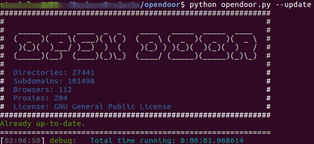

Usage
=====

Basic usage
===========

Run a simple directory scan:

```shell
python3 opendoor.py --host http://www.example.com
```

Installed entrypoint usage:

```shell
opendoor --host http://www.example.com
```



Help
====

```shell
usage: opendoor [-h] [--host HOST] [-p PORT] [-m METHOD] [-t THREADS] [-d DELAY] [--timeout TIMEOUT] [-r RETRIES] [--keep-alive] [--accept-cookies] [--debug DEBUG] [--tor] [--torlist TORLIST] [--proxy PROXY]
                [-s SCAN] [-w WORDLIST] [--reports REPORTS] [--reports-dir REPORTS_DIR] [--random-agent] [--random-list] [--prefix PREFIX] [-e EXTENSIONS] [-i IGNORE_EXTENSIONS] [--sniff SNIFF] [--update]
                [--version] [--examples] [--docs] [--wizard [WIZARD]]

options:
  -h, --help            show this help message and exit

required named options:
  --host HOST           Target host; example: --host http://example.com

Application tools:
  --update              Show package update instructions
  --version             Show current version
  --examples            Show usage examples
  --docs                Open documentation
  --wizard [WIZARD]     Run scanner wizard from your config

Debug tools:
  --debug DEBUG         Debug level -1 (silent), 1 - 3

Reports tools:
  --reports REPORTS     Scan reports (json,std,txt,html)
  --reports-dir REPORTS_DIR
                        Path to custom reports directory

Request tools:
  -p, --port PORT       Custom port (default 80)
  -m, --method METHOD   Request method (HEAD by default)
  -d, --delay DELAY     Delay between threaded requests
  --timeout TIMEOUT     Request timeout (30 sec default)
  -r, --retries RETRIES
                        Maximum reconnect retries (default 3)
  --keep-alive          Use keep-alive connection
  --accept-cookies      Accept and route cookies from responses
  --tor                 Use built-in proxy list
  --torlist TORLIST     Path to custom proxy list
  --proxy PROXY         Custom permanent proxy server
  --random-agent        Randomize user-agent per request

Sniff tools:
  --sniff SNIFF         Response sniff plugins (indexof,collation,file,skipempty,skipsizes=NUM:NUM...)

Stream tools:
  -t, --threads THREADS
                        Allowed threads

Wordlist tools:
  -s, --scan SCAN       Scan type: directories or subdomains
  -w, --wordlist WORDLIST
                        Path to custom wordlist
  --random-list         Shuffle scan list
  --prefix PREFIX       Append path prefix to scan host
  -e, --extensions EXTENSIONS
                        Force selected extensions for the scan session, e.g. php,json
  -i, --ignore-extensions IGNORE_EXTENSIONS
                        Ignore selected extensions for the scan session, e.g. aspx,jsp
```

Arguments description
=====================

Application tools
-----------------

**--update**  
Show update instructions for modern package-based environments.

```shell
opendoor --update
```

**--version**  
Show the current local version and compare it with the latest published version.

```shell
opendoor --version
```

**--examples**  
Show usage examples.

```shell
opendoor --examples
```

**--docs**  
Open the project documentation.

```shell
opendoor --docs
```

**--wizard**  
Run the configuration wizard. `opendoor.conf` is used by default.

```shell
opendoor --wizard
opendoor --wizard /usr/local/path/to/project.conf
```

Required arguments
------------------

**--host**  
Target host or IP address. Scheme may also be included.

```shell
opendoor --host www.example.com
opendoor --host https://www.example.com
opendoor --host 127.0.0.1
```

Request tools
-------------

**--port, -p**  
Custom port. Default is usually 80 for HTTP and 443 for HTTPS.

```shell
opendoor --host www.example.com --port 8080
```

**--method, -m**  
HTTP request method. `HEAD` is the default.

```shell
opendoor --host www.example.com --method GET
```

**--delay, -d**  
Delay between threaded requests.

```shell
opendoor --host www.example.com --delay 1
```

**--timeout**  
Request timeout in seconds.

```shell
opendoor --host www.example.com --timeout 60
```

**--retries, -r**  
Maximum reconnect retries.

```shell
opendoor --host www.example.com --retries 5
```

**--keep-alive**  
Use keep-alive connections.

```shell
opendoor --host www.example.com --keep-alive
```

**--accept-cookies**  
Accept and reuse cookies from responses.

```shell
opendoor --host www.example.com --accept-cookies
```

**--tor**  
Use the built-in proxy list.

```shell
opendoor --host www.example.com --tor
```

**--torlist**  
Use a custom proxy list file.

```shell
opendoor --host www.example.com --torlist /path/to/proxy-list.txt
```

**--proxy**  
Use a permanent proxy server.

```shell
opendoor --host www.example.com --proxy socks5://127.0.0.1:9050
```

**--random-agent**  
Randomize the user-agent per request.

```shell
opendoor --host www.example.com --random-agent
```

Stream tools
------------

**--threads, -t**  
Number of worker threads.

```shell
opendoor --host www.example.com --threads 10
```

Wordlist tools
--------------

**--scan, -s**  
Scan type: `directories` or `subdomains`.

```shell
opendoor --host www.example.com --scan directories
opendoor --host example.com --scan subdomains
```

**--wordlist, -w**  
Use a custom wordlist file.

```shell
opendoor --host www.example.com --wordlist /path/to/wordlist.txt
```

**--random-list**  
Shuffle the scan list.

```shell
opendoor --host www.example.com --random-list
```

**--prefix**  
Append a path prefix to the target host.

```shell
opendoor --host www.example.com --prefix admin/
```

**--extensions, -e**  
Force selected extensions for the scan session.

```shell
opendoor --host www.example.com --extensions php,json
```

**--ignore-extensions, -i**  
Ignore selected extensions for the scan session.

```shell
opendoor --host www.example.com --ignore-extensions aspx,jsp
```

Reports tools
-------------

**--reports**  
Select output report formats.

```shell
opendoor --host www.example.com --reports std,txt,json,html
```

**--reports-dir**  
Write reports to a custom directory.

```shell
opendoor --host www.example.com --reports txt,html --reports-dir /tmp/reports
```

Debug tools
-----------

**--debug**  
Set debug level from `-1` to `3`.

```shell
opendoor --host www.example.com --debug 1
opendoor --host www.example.com --debug 3
```

Sniff tools
-----------

**--sniff**  
Apply response sniff plugins.

```shell
opendoor --host www.example.com --sniff indexof,skipempty
opendoor --host www.example.com --sniff file,collation,skipsizes=25:50:100
```
